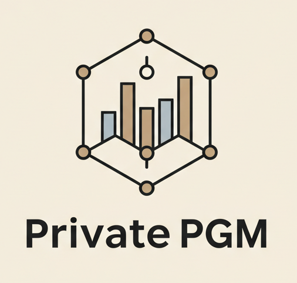

## MBI: Marginal-Based Estimation and Inference
**(with applications to differential privacy)**

Documentation can be found at
[https://private-pgm.readthedocs.io/en/latest/](https://private-pgm.readthedocs.io/en/latest/)!
